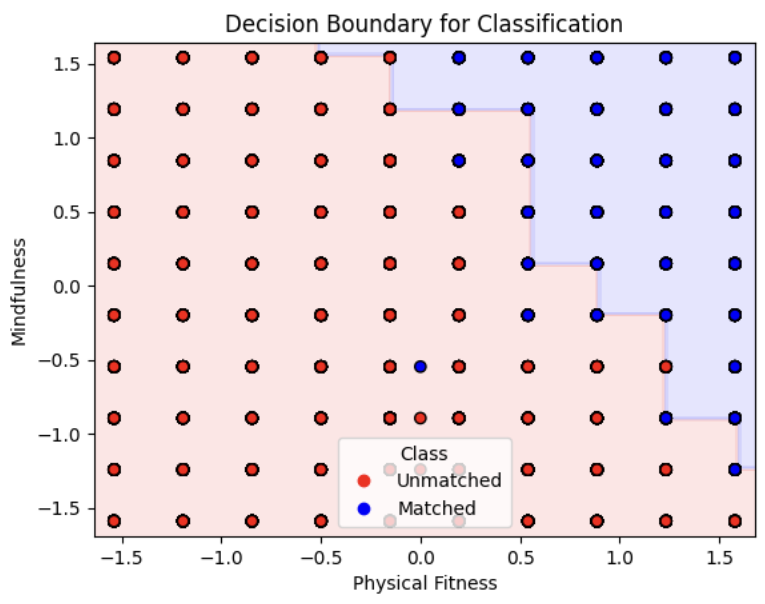

# Predicting Health Status using XGBoost

## Overview
This project aims to predict whether an individual is healthy based on various lifestyle factors such as physical fitness, sleep hours, activity levels, career, and dietary preferences. The dataset undergoes preprocessing, feature engineering, and model training using XGBoost to optimize classification accuracy.

**Colab link**: https://colab.research.google.com/drive/14i3yzONpTruinohf9yhyY2ygzKPpPUcp?usp=sharing

## Tech Stack
- **Python**: Primary programming language
- **Pandas**: Data manipulation and preprocessing
- **NumPy**: Numerical computations
- **Matplotlib & Seaborn**: Data visualization
- **Scikit-learn**: Preprocessing, encoding, and evaluation
- **XGBoost**: Machine learning model for classification
- **Pickle**: Model persistence and storage

## Context
Modern lifestyle choices significantly impact health outcomes. By leveraging machine learning techniques, this project classifies individuals as 'healthy' or 'unhealthy' based on various lifestyle factors. The dataset is preprocessed to handle missing values, encode categorical features, and scale numerical attributes before training an optimized XGBoost model.

## Solution Approach
1. **Data Preprocessing**
   - Handling missing values using `SimpleImputer`
   - Encoding categorical variables with `LabelEncoder`
   - Scaling numerical features with `StandardScaler`

2. **Feature Engineering**
   - Created new interaction-based features:
     - `fitness_x_act = phy_fitness * act_level`
     - `sleep_mind = sleep_hrs * mindfulness`
     - `steps_cal_ratio = daily_avg_steps / (daily_avg_calories + 1e-6)`

3. **Model Training & Optimization**
   - Split data into train and test sets (80/20 split)
   - Used `GridSearchCV` to tune hyperparameters for `XGBClassifier`
   - Evaluated model performance using accuracy score

4. **Visualization**
   - Plotted decision boundary for `phy_fitness` and `mindfulness`
   - Displayed results using `matplotlib` and `seaborn`

## Results


### Accuracy Plot


### Decision Boundary


## How to Run the Project
1. Install dependencies:
   ```sh
   pip install pandas numpy matplotlib seaborn scikit-learn xgboost
   ```
2. Place the dataset (`innovize_final_ml.csv`) in the gdrive directory.
3. Run the script in the colab notebook
4. Save trained model as `final_model.sav`.
5. Load the model and test predictions

## Contributors
- **Aditya Yedurkar** 
- **Abhi Mehta**

---
This project serves as a robust example of leveraging machine learning for health analytics, offering insights into how lifestyle choices impact well-being.

